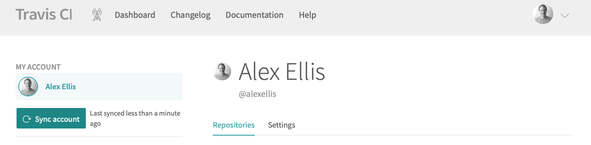
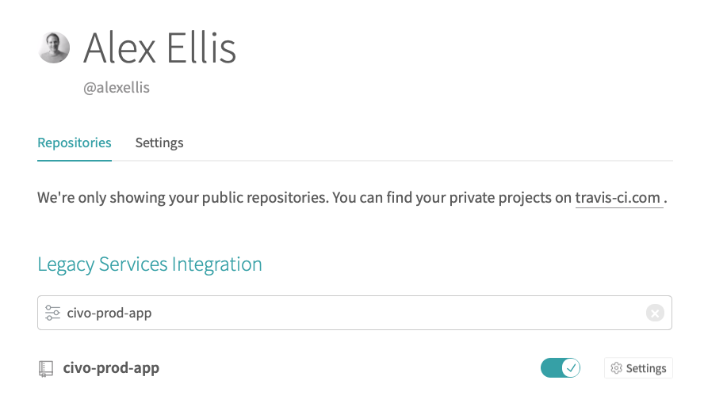
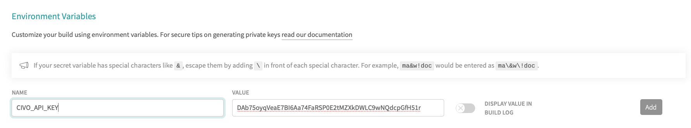
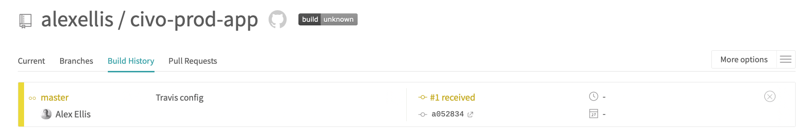
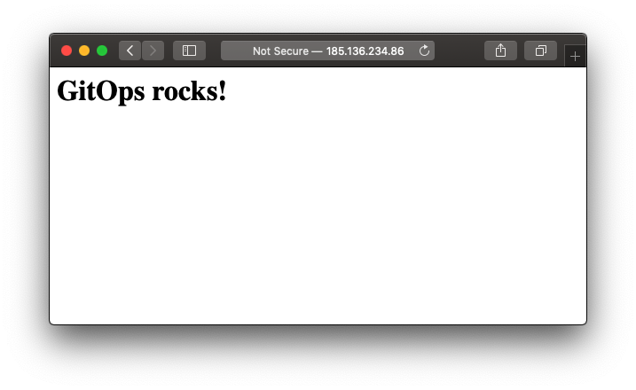

# Deploy your applications to Civo with GitOps


In this learn guide we will apply the principles of GitOps to deploy applications to VMs on Civo whenever changes are committed to our GitHub repository.

## What is GitOps?

GitOps was first coined by Alexis Richardson, the CEO of Weaveworks.

[Alexis describes](https://www.weave.works/blog/what-is-gitops-really) GitOps as the following:

> Describe the desired state of the whole system using a declarative specification for each environment.

That means that you can at any time delete your staging or production cluster, and immediately recreate it from the configuration and descriptions stored in a `git` repository. By using `git` we can add new changes, releases or even revert back to a known state by performing operations on our source control system.

Another way that Alexis talks about GitOps is: "Operations by Pull Request"

You could imagine that you are a growing team with all your code stored in GitHub. You restrict access to various GitHub repositories through the use of "teams". When following a GitOps model, you can on-board a new member of staff simply by sending a pull-request to a repository where you keep your team definitions.

Isn't this just Continuous Delivery, or Infrastructure as Code? Haven't we seen it all before? It can be a confusing topic, so checkout the post on [What is GitOps really?](http://bit.ly/2MJgwVm)

### How can we use GitOps with Civo's new CLI?

The Civo team recently released a new CLI which has been completely re-written in Ruby. It can be used to manage your infrastructure on the platform including:

* VM instances
* Firewalls
* Load balancers
* Images / snapshots / templates
* And more

All of the above is also available through the [developer API](https://www.civo.com/api) with code examples. The CLI brings a user-friendly experience to the API and means you can authenticate and create a new VM with ease.

This tool sounds ideal for use in a GitOps pipeline which we will explore in the tutorial.

### A quick look at the CLI

The CLI is open source and [available on GitHub](https://github.com/civo/cli) if you would like to browse the code. It's written in Ruby and has been published on Rubygems meaning that the installation experience is very simple:

```sh
# gem install civo_cli
```

You will need at least Ruby 2.0, which should be available on a modern Mac. For installation on Windows and Linux, see the [setup guide](https://github.com/civo/cli#set-up).

Now that we have the CLI we can authenticate:

```sh
# export KEY="DAb75oyqVeaE7BI6Aa74FaRSP0E2tMZXkDWLC9wNQdcpGfH51r"
# civo apikey add production $KEY
Saved the API Key DAb75oyqVeaE7BI6Aa74FaRSP0E2tMZXkDWLC9wNQdcpGfH51r as production
```

I'm using the sub-command `apikey` to `add` a key named `production`. This key will be saved in a config file, so that I don't need to provide it multiple times.

To get your own API key, just log into [https://www.civo.com/api](https://www.civo.com/api) and copy it from the browser.

Let's activate the key:

```sh
# civo api production
The current API Key is now production
```

Now let's test out one of the commands:

```sh
# civo
Commands:
  civo apikey          # manage API keys stored in the client
  civo blueprint       # manage blueprints
  civo domain          # manage DNS domains
  civo domainrecord    # manage domain name DNS records for a domain
  civo firewall        # manage firewalls
  civo help [COMMAND]  # Describe available commands or one specific command
  civo instance        # manage instances
  civo network         # manage networks
  civo quota           # view the quota
  civo region          # manage regions
  civo size            # manage sizes
  civo snapshot        # manage snapshots
  civo sshkey          # manage uploaded SSH keys
  civo template        # manage templates
  civo version         # show the version of Civo CLI used
  civo volume          # manage volumes
```

For our GitOps Tutorial I would like to create an instance.

```sh
# civo instance create --help
Usage:
  civo instance create [HOSTNAME] [...]

Options:
      [--size=instance_size_code]                      
                                                       # Default: g2.small
      [--region=civo_region]                           
                                                       # Default: lon1
      [--public-ip=true | false | from [instance_id]]  
                                                       # Default: true
  --user, [--initial-user=username]                    
                                                       # Default: civo
      [--template=template_id]                         
      [--snapshot=snapshot_id]                         
      [--ssh-key=ssh_key_id]                           
      [--tags='tag1 tag2 tag3...']                     
      [--wait], [--no-wait]                            

Description:
  Create a new instance with hostname (randomly assigned if blank), instance size (default: g2.small), 
  template or snapshot ID (default: Ubuntu 18.04 template).
```

So it looks like we have some helpful defaults to get started with, and then we can specify some additional values like hostname, too.

We do need to find the template ID for Ubuntu, since that's what we want to run on.

```sh
# civo template list |grep "Ubuntu 18"
| 811a8dfb-8202-49ad-b1ef-1e6320b20497 | Ubuntu 18.04         | e4838e89-f086-41a1-86b2-60bc4b0a259e | 98feca21-6cdb-439e-bd0f-3311c693f350 | ubuntu           |
```

Great, it's `811a8dfb-8202-49ad-b1ef-1e6320b20497`, so:

```sh
export HOST="gitops-production"
export TEMPLATE="811a8dfb-8202-49ad-b1ef-1e6320b20497"
# civo instance create \
  ${HOST} \
  --template=${TEMPLATE}

Created instance gitops-production
```

We've now created our first VM with the new CLI 🎉.

## Tutorial

We'll create a GitHub repository and then add a config file. The config file will declare what VMs we need/want and what names they will have.

Every time we commit code we'll check if the VMs exist, and if they don't we'll provision them using the CLI. That means we need to work out how to list VMs.

We also need to copy our SSH key across, so that we can deploy our application. Since our SSH key will be a "secret", we'll configure this in our build system "Travis" as a secret environment variable. The other secret we will have is our Civo API key, but don't worry, both will be masked and encrypted.

### Create the repo

Create a new repo and call it "civo-prod-app":


### Turn on the repo in Travis

Travis is a CI tool which can be triggered by "git", it's a SaaS product, so we don't have to host our own CI pipeline. It's used by many OSS projects such as [OpenFaaS](https://github.com/openfaas/).

Sign-up for Travis, if you haven't already.

You may also need to sync your Git repos:



Turn on the Git repo:



### Add the secrets

You will need an SSH key to log into the instance via the GitOps workflow on Travis. For your SSH key, you can generate a new one or use your local SSH key.

Find your ssh key in `$HOME/.ssh/`, note that if you don't have a key, you can generate one with `ssh-keygen`.

For example:

```sh
# ssh-keygen 
Generating public/private rsa key pair.
Enter file in which to save the key (/Users/alex/.ssh/id_rsa): /Users/alex/go/src/github.com/alexellis/civo-cli-blogpost/id_rsa
Enter passphrase (empty for no passphrase): 
Enter same passphrase again: 
Your identification has been saved in /Users/alex/go/src/github.com/alexellis/civo-cli-blogpost/id_rsa.
Your public key has been saved in /Users/alex/go/src/github.com/alexellis/civo-cli-blogpost/id_rsa.pub.
The key fingerprint is:
SHA256:PXVGBq8t7Fs4NKYdvZze6d2jR0y2Y4uPdIJB2H6DAzk alex@space-mini.local
The key's randomart image is:
+---[RSA 2048]----+
|            ..o  |
|          +  +   |
|         E o. +  |
|         .=o.* o |
|        S o=Oo* .|
|           B=*.O |
|          ..=oO.o|
|            .*+=+|
|            .o*+=|
+----[SHA256]-----+
```

Go to "Settings" and add your three secrets:



* 1) Add `CIVO_API_KEY`
* 2) Add `SSH_PUBLIC_KEY` (this needs to be converted into a single line with `cat id_rsa.pub | base64`)
* 3) Add `SSH_PRIVATE_KEY` (this needs to be converted into a single line with `cat id_rsa | base64`)

Make sure that the values are not displayed in the logs, this is an option in the UI.

### Add your SSH key to your Civo dashboard

Make sure that your SSH key is inserted on your Civo dashboard.

Use the content from the `id_rsa.pub` file.


### Identify your Civo SSH key

Now we have to identify your Civo SSH key, so that we can use it in the CLI when we create a new VM. It will allow an automated, non-interactive login. This is just what we need for a GitOps pipeline.

```sh
# civo ssh-key list

+--------------------------------------+-----------------------+----------------------------------------------------+
| ID                                   | Name                  | Fingerprint                                        |
+--------------------------------------+-----------------------+----------------------------------------------------+
| 5f81118c-1a69-4ba8-af0a-a73c308b3f51 | alex@space-mini.local | SHA256:PXVGBq8t7Fs4NKYdvZze6d2jR0y2Y4uPdIJB2H6DAzk |
```

We now have an ID, so we can add that as an environment variable on the Travis page:

* Add `SSH_KEY_ID` with the value from the `ID` field. You can allow this value to be shown in the logs, because it is not a secret.

### Check the Civo CLI's connectivity

Now let's define a .travis.yml file that can run and verify that our configuration worked correctly.

* Create `.travis.yml` in your repo:

```yaml
language: ruby

sudo: false

#services:
#  - docker

install:
- ./gitops/prepare.sh

script:
- ./gitops/deploy.sh
```

Now create `./gitops/prepare.sh` in the repo:

```sh
#!/bin/bash

gem install civo_cli
civo apikey add production "${CIVO_API_KEY}"
civo apikey current production

civo instance list


export KEY_DIR="$HOME/.ssh"

echo "Creating SSH keys: $KEY_DIR"

mkdir -p $KEY_DIR
chmod 700 $KEY_DIR

# Convert the text back into human-readable format:
echo -n "${SSH_PUBLIC_KEY}" | base64 --decode > $KEY_DIR/id_rsa.pub
echo -n "${SSH_PRIVATE_KEY}" | base64 --decode > $KEY_DIR/id_rsa

chmod 600 $KEY_DIR/id_rsa

echo -n $SSH_KEY_ID > $HOME/key_ids.txt

# Check the keys exist correctly:
echo "HOME: $HOME"

cat $HOME/.ssh/id_rsa.pub
stat $HOME/.ssh/id_rsa
```

The job of `prepare.sh` is to rehydrate the secrets back onto the disk so that they can be used in our pipeline.

* Create `./gitops/deploy.sh` in the repo:

```sh
#!/bin/bash

echo `pwd`

civo apikey current production
civo instance list
```

Make both scripts runnable:

```sh
chmod +x gitops/*
```

Now add the three files and push them to GitHub:

```sh
git add .
git commit --signoff -m "Initial"
git push origin master
```

You'll see a build pending:



Then click to see the logs, you should see a list of our instances including the one we created at the start of this guide.

```
+--------------------------------------+-------------------------+-------------+--------+-----------------+--------+
| ID                                   | Hostname                | Size        | Region | Public IP       | Status |
+--------------------------------------+-------------------------+-------------+--------+-----------------+--------+
| 27e0ffd0-7f56-4a19-b344-e157d5652bf2 | gitops-prod             | Small       | lon1   | <redacted>      | ACTIVE |
```

### Create a VM with GitOps

One of the attractions to GitOps is that it's declarative, which means it can remediate the state we desire based upon the state found.

If the VM is present, it should run the commands we need via `ssh` to deploy our code.

If the VM is not present, it should create it.

If we changed any specification about the VM, it should re-create it. I.e. moving from Ubuntu 16.04 to 18.04. (Note this will be out of scope for our initial post)

Edit `./gitops/deploy.sh`:

```sh
#!/bin/bash

export HOSTNAME="gitops-prod.example.com"

civo apikey current production

civo instance show "${HOSTNAME}"
export EXISTS=$?
export TEMPLATE="811a8dfb-8202-49ad-b1ef-1e6320b20497"

if [ "${EXISTS}" -ne "0" ]
then
    civo instance create \
    ${HOSTNAME} \
    --template=${TEMPLATE} \
    --ssh-key="${SSH_KEY_ID}"
fi
```

Commit the script and see what happens:

```sh
git add .
git commit --signoff -m "Create VM if it doesn't exist"
git push origin master
```

### Now let's add in the deployment

We'll now run an SSH command to test everything works:

```sh
ssh -i $HOME/.ssh/id_rsa civo@$IP "cat /etc/os-release"
```

Edit `./gitops/deploy.sh`:

```sh
#!/bin/bash

export HOSTNAME="gitops-prod.example.com"

civo apikey current production

civo instance show "${HOSTNAME}"
export EXISTS=$?
export TEMPLATE="811a8dfb-8202-49ad-b1ef-1e6320b20497"

if [ "${EXISTS}" -ne "0" ]
then
    civo instance create \
    ${HOSTNAME} \
    --template=${TEMPLATE} \
    --ssh-key="${SSH_KEY_ID}"
fi

# Instance takes 40 secs +/- to build
for i in {0..120}; do
    civo instance show "${HOSTNAME}" > instance.txt
    grep "ACTIVE" instance.txt

    if [ "$?" -eq "0" ]
    then
        echo "VM found, and active"

        export IP=$(grep "Public IP" instance.txt | cut -d ">" -f2 |tr -d " ") 
        echo $IP
        ssh -i $HOME/.ssh/id_rsa -oStrictHostKeyChecking=no civo@$IP "cat /etc/os-release"

        break
    fi

    sleep 10
done
```

Commit the script and see what happens:

```sh
git add .
git commit --signoff -m "Create VM if needed and then get the os-release"
git push origin master
```

The script does the following:

* Creates a VM if it doesn't exist
* Waits for the VM to become ready
* Logs in with SSH and then runs a command

### Finally, deploy the code

We've now set up our infrastructure through GitOps.

Let's deploy an application. It'll be a static site, served with Nginx.

Create `index.html` in `webroot` in the repository:

```html
<html>
<body>
    <h1>GitOps rocks!</h1>
</body>
</html>
```

Edit `./gitops/deploy.sh`:

```sh
#!/bin/bash

export HOSTNAME="gitops-prod.example.com"

civo apikey current production

civo instance show "${HOSTNAME}"
export EXISTS=$?
export TEMPLATE="811a8dfb-8202-49ad-b1ef-1e6320b20497"

if [ "${EXISTS}" -ne "0" ]
then
    civo instance create \
    ${HOSTNAME} \
    --template=${TEMPLATE} \
    --ssh-key="${SSH_KEY_ID}"
fi

# Instance takes 40 secs +/- to build
for i in {0..120}; do
    echo "Checking instance status, attempt: $i"

    civo instance show "${HOSTNAME}" > instance.txt
    grep "ACTIVE" instance.txt

    if [ "$?" -eq "0" ]
    then
        echo "VM found, and active"

        export IP=$(grep "Public IP" instance.txt | cut -d ">" -f2 |tr -d " ") 
        echo $IP

        ssh -i $HOME/.ssh/id_rsa -oStrictHostKeyChecking=no civo@$IP "uptime"
        # SSH may not be up and running yet, so continue
        if [ "$?" -ne "0" ]
        then
            sleep 5
            continue
        fi
        ssh -i $HOME/.ssh/id_rsa -oStrictHostKeyChecking=no civo@$IP "sudo apt update && sudo apt install -qy nginx"
        scp -i $HOME/.ssh/id_rsa -r -oStrictHostKeyChecking=no webroot civo@$IP:~/webroot
        ssh -i $HOME/.ssh/id_rsa -oStrictHostKeyChecking=no civo@$IP "sudo rm -rf /var/www/html/* && sudo cp -r webroot/* /var/www/html/"

        break
    fi

    sleep 10
done
```

We edited the script to do the following:

* Install or update nginx
* Copy over the webroot directory
* Deploy the static HTML site

Commit the script and see what happens:

```sh
git add .
git commit --signoff -m "Install Nginx and deploy the static website"
git push origin master
```

You should see an output like this:



Now delete the VM instance with:

```sh
export HOSTNAME="gitops-prod.example.com"
civo instance delete $HOSTNAME
```

Edit one of the files and do another commit, you'll see your instance come back up with a new IP in the Travis job within a few moments.

```sh
echo "Trigger a build" > "automated.txt"
git add .
git commit --signoff -m "Recreate my instance"
git push origin master
```

Now try to edit your webpage:


Edit `index.html` in `webroot` in the repository:

```html
<html>
<body style="background: green; text: white">
    <h1>GitOps rocks!</h1>
</body>
</html>
```

Deploy it:

```sh
git add .
git commit --signoff -m "Update my webpage"
git push origin master
```

### Wrapping up

To wrap up this guide, we have tried out the Civo CLI to create instances, found out how to install it and how to add our API key. We then went on to setup a full GitOps pipeline using bash scripts and deployed a static website with Nginx. Our bash script became a controller, tasked with remediating our desired state.

If we took things further we could write that code in Ruby, Go or Node.js for instance and then come up with a JSON, YAML or DSL file to store our state. It might look a bit like this:

```yaml
# This is just an example.
hostname: gitops-production.example.com
folders:
 - name: webroot
   source: ./webroot
   destination: /var/www/html/
packages:
 - name: nginx
   update_apt: true
   package: "nginx"
```

You could use the example GitHub repository with any client and know that if you ever lost a VM host, you could restore the state back to how it was by simple triggering a `git commit`. You can think of GitOps as a kind of insurance policy.

We could extend what we are deploying in Civo and create a firewall along with a load-balancer so that our instance can be replaced without our users knowing.

* Find out more about [Travis](https://travis-ci.org)
* Hear [Alexis talking about GitOps and Kubernetes](https://www.youtube.com/watch?v=BSqE2RqctNs) at KubeCon
* Star the [Civo CLI](https://github.com/civo/cli)
